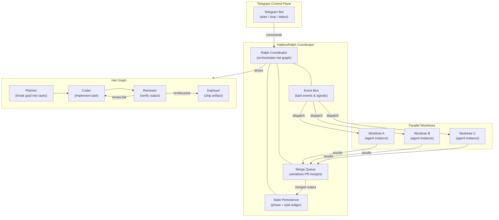

## Ralph Orchestrator — A Rust Platform for AI Agent Fleets

*Agentic Development: 10 Lessons from 8,481 AI Coding Sessions (Post 8 of 11)*

When you are running one AI coding agent, you manage it by watching the terminal. When you are running five agents in parallel across three projects, you need an orchestration layer. When you are running 30 agents overnight with backpressure gates, event-sourced merge queues, and a Telegram control plane so you can steer them from your phone at 2 AM — you need Ralph.

Ralph Orchestrator is a Rust platform that treats AI agents the way Kubernetes treats containers: isolated environments, clear objectives, structured handoffs, and a persistent control loop that survives session boundaries. I have run 410 orchestration sessions through it, coordinating fleets of AI agents across iOS, backend, and web projects. The hardest problems were never technical. They were trust calibration — learning when to let the agent run and when to intervene.

This post covers the architecture, the six tenets that emerged from those 410 sessions, and real TOML configurations and Python scripts you can use today.

---



---

### The Core Insight: Hats

Ralph's most distinctive feature is the hat system. Each agent wears a "hat" — a focused role that defines its capabilities, context, event subscriptions, and model selection for each iteration.

A monolithic prompt that tries to cover planning, coding, reviewing, and deploying produces mediocre results in all four areas. A planner hat with Opus-level reasoning produces specialist-quality architecture. A coder hat with Sonnet produces fast, focused implementation. A reviewer hat with Opus catches subtle bugs that Sonnet misses.

Here is what a hat configuration looks like in TOML:

```toml
# From docs/hat-system.md
# ralph-orchestrator-guide/docs/hat-system.md

[hats.planner]
description = "Plans the implementation approach"
model = "opus"
subscribes = ["project.start", "review.fail"]
publishes = ["plan.complete", "human.interact"]
instructions = """
You are a technical planner. Analyze the objective and create
a step-by-step implementation plan. Consider edge cases,
dependencies, and potential blockers.
"""

[hats.coder]
description = "Implements the plan"
model = "sonnet"
subscribes = ["plan.complete"]
publishes = ["code.complete", "human.interact"]
instructions = """
You are an implementation engineer. Follow the plan exactly.
Build one component at a time. Verify the build after each change.
"""

[hats.reviewer]
description = "Reviews code quality and correctness"
model = "opus"
subscribes = ["code.complete"]
publishes = ["review.pass", "review.fail"]
instructions = """
You are a code reviewer. Check for bugs, security issues,
performance problems, and adherence to the plan. Be specific
in your feedback.
"""
```

Hats form a directed graph connected by events. When the planner publishes `plan.complete`, the coordinator transitions to the coder hat. When the reviewer publishes `review.fail`, the coordinator routes back to coder. The hat graph is the execution topology of your agent fleet:

```
planner                    coder                     reviewer
Subscribes:                Subscribes:               Subscribes:
  project.start  -------->   plan.complete -------->   code.complete
Publishes:                 Publishes:                Publishes:
  plan.complete              code.complete             review.pass
  human.interact             human.interact            review.fail
                                   ^                         |
                                   +--- review.fail ---------+
```

Different project types get different hat graphs. The companion repo ships four pre-built configurations:

```toml
# From configs/ios-mobile.toml
# ralph-orchestrator-guide/configs/ios-mobile.toml

[agent]
name = "ios-mobile"
description = "iOS/macOS specialist for Swift and SwiftUI development"
model = "sonnet"
max_tokens = 8192
temperature = 0.1

[agent.identity]
role = "Senior iOS Engineer"
expertise = [
    "Swift", "SwiftUI", "UIKit",
    "Combine", "async/await", "Actors",
    "Core Data", "SwiftData",
    "Xcode", "XcodeGen", "SPM",
    "StoreKit", "CloudKit", "WidgetKit",
    "Accessibility", "Localization",
    "App Store Review Guidelines"
]

[loop.backpressure]
build_ios = "xcodebuild -scheme $SCHEME -destination 'id=$SIMULATOR_UDID' -quiet"
build_macos = "xcodebuild -scheme $MACOS_SCHEME -destination 'platform=macOS' -quiet"
lint = "swiftlint lint --quiet"
```

The systems configuration shows the same pattern for backend work:

```toml
# From configs/systems.toml
# ralph-orchestrator-guide/configs/systems.toml

[agent.identity]
role = "Senior Backend Engineer"
expertise = [
    "Rust", "Go", "Python", "Node.js",
    "PostgreSQL", "Redis", "SQLite",
    "REST APIs", "gRPC", "GraphQL",
    "Docker", "Kubernetes", "Terraform",
    "Security", "Performance", "Observability"
]

[loop.backpressure]
build = "cargo build"
test = "cargo test"
lint = "cargo clippy -- -D warnings"
security = "cargo audit"
```

---

### The Six Tenets

These tenets emerged from 410 orchestration sessions. They are not theoretical principles. They are scar tissue.

---

### Tenet 1: The Boulder Never Stops

A Ralph loop continues working until all tasks are complete or an explicit kill signal is received. Session boundaries are checkpoints, not endpoints.

This is implemented through the stop hook — a bash script that runs whenever a stop signal fires. If tasks remain, the hook injects a continuation message and the loop keeps going:

```bash
# From examples/persistence-loop/stop-hook.sh
# ralph-orchestrator-guide/examples/persistence-loop/stop-hook.sh

#!/usr/bin/env bash
# Ralph Stop Hook -- "The Boulder Never Stops"

STATE_FILE=".ralph/loop-state.json"
TASKS_FILE=".ralph/agent/tasks.jsonl"
GUIDANCE_FILE=".ralph/guidance.jsonl"

# Count remaining tasks
if [ -f "$TASKS_FILE" ]; then
    PENDING=$(grep -c '"status":\s*"pending"' "$TASKS_FILE" 2>/dev/null || echo "0")
    IN_PROGRESS=$(grep -c '"status":\s*"in_progress"' "$TASKS_FILE" 2>/dev/null || echo "0")
    REMAINING=$((PENDING + IN_PROGRESS))
else
    REMAINING=0
fi

# Check for explicit kill signal
if [ -f ".ralph/kill.signal" ]; then
    echo "Kill signal detected. Stopping." >&2
    rm -f ".ralph/kill.signal"
    echo "stop"
    exit 0
fi

# The boulder never stops -- if tasks remain, keep going
if [ "$REMAINING" -gt 0 ]; then
    echo "Tasks remaining: $REMAINING. The boulder never stops." >&2

    TIMESTAMP=$(date -u +"%Y-%m-%dT%H:%M:%SZ")
    mkdir -p "$(dirname "$GUIDANCE_FILE")"
    echo "{\"type\":\"continuation\",\"timestamp\":\"$TIMESTAMP\",\"message\":\"The boulder never stops. $REMAINING tasks remain. Continue working.\"}" >> "$GUIDANCE_FILE"

    echo "continue"
    exit 0
fi

# All tasks complete -- stop gracefully
echo "All tasks complete. Loop can stop." >&2
echo "stop"
exit 0
```

The persistence configuration makes this work across session restarts:

```toml
# From examples/persistence-loop/persistence.toml
# ralph-orchestrator-guide/examples/persistence-loop/persistence.toml

[loop]
max_iterations = 200
checkpoint_interval = 3
timeout_minutes = 480              # 8 hours

[loop.persistence]
enabled = true
state_file = ".ralph/loop-state.json"
resume_on_start = true
checkpoint_includes = [
    "iteration",
    "current_hat",
    "task_progress",
    "memory_snapshot",
    "cost_accumulator",
]

[loop.stop_hook]
script = "bash stop-hook.sh"
behavior = "check_and_decide"
```

The state manager provides visibility into the persistence system:

```python
# From examples/persistence-loop/state-manager.py
# ralph-orchestrator-guide/examples/persistence-loop/state-manager.py

def write_state(state: dict[str, Any]) -> None:
    """Write loop state to disk atomically."""
    STATE_FILE.parent.mkdir(parents=True, exist_ok=True)

    # Write to temp file first, then rename (atomic on POSIX)
    tmp = STATE_FILE.with_suffix(".tmp")
    tmp.write_text(json.dumps(state, indent=2))
    tmp.rename(STATE_FILE)

def cmd_status() -> None:
    """Show the current loop state."""
    state = read_state()

    print("=== Ralph Loop State ===")
    print(f"Status:     {state.get('status', 'unknown')}")
    print(f"Iteration:  {state.get('iteration', 0)}/{state.get('max_iterations', '?')}")
    print(f"Hat:        {state.get('current_hat', 'none')}")

    tasks = get_task_summary()
    if tasks["total"] > 0:
        print(f"\nTasks:      {tasks['completed']}/{tasks['total']} complete")

    cost = state.get("total_cost", 0)
    if cost:
        print(f"Cost:       ${cost:.4f}")
```

Atomic writes via tmp-file-then-rename prevent state corruption from mid-write crashes. The state manager supports `status`, `checkpoint`, `resume`, `reset`, and `history` commands. When a loop runs overnight and you want to check progress in the morning, `python state-manager.py status` gives you the full picture.

---

### Tenet 2: Hats Define Capability

Covered in detail above. The key insight: focused roles produce specialist-quality output. A hat that plans AND codes AND reviews is just a monolithic prompt with extra steps.

---

### Tenet 3: The Plan Is Disposable

Regenerating a plan costs one planning iteration — about $0.05 and 30 seconds. Clinging to a failing plan costs hours of wasted iterations.

This sounds obvious written down. In practice, I watched agents fight failing plans for 15–20 iterations before I learned to encode this as a tenet. When a plan hits a dead end — build fails repeatedly, a core assumption turns out to be wrong, the approach leads to unnecessary complexity — the right move is to discard the plan and regenerate from current state.

---

### Tenet 4: Telegram as Control Plane

When agents run overnight or in parallel, you need a way to steer them from your phone. The Telegram bot is not a notification system — it is a remote control plane for human-in-the-loop orchestration.

The bot configuration defines what notifications fire and when:

```toml
# From examples/telegram-bot/bot-config.toml
# ralph-orchestrator-guide/examples/telegram-bot/bot-config.toml

[telegram]
bot_token_env = "RALPH_TELEGRAM_BOT_TOKEN"
chat_id_env = "RALPH_TELEGRAM_CHAT_ID"
enabled = true

[telegram.notifications]
on_iteration_start = false         # Too noisy
on_iteration_complete = false      # Also noisy
on_checkpoint = true               # Every N iterations
on_human_interact = true           # Agent needs input -- ALWAYS notify
on_error = true
on_loop_complete = true
on_merge_complete = true
on_merge_failed = true

[telegram.interaction]
timeout_seconds = 300              # Wait 5 min for human response
timeout_action = "continue"        # On timeout: continue with default
```

The command handlers implement the control plane:

```python
# From examples/telegram-bot/commands.py
# ralph-orchestrator-guide/examples/telegram-bot/commands.py

def cmd_status() -> str:
    """/status -- Show current loop state."""
    state = read_state()

    tasks = read_tasks()
    total = len(tasks)
    completed = sum(1 for t in tasks if t.get("status") == "completed")
    in_progress = sum(1 for t in tasks if t.get("status") == "in_progress")
    pending = sum(1 for t in tasks if t.get("status") == "pending")

    paused = " [PAUSED]" if PAUSE_FLAG.exists() else ""

    return (
        f"Status: {state.get('status', 'unknown')}{paused}\n"
        f"Iteration: {state.get('iteration', 0)}/{state.get('max_iterations', '?')}\n"
        f"Hat: {state.get('current_hat', 'none')}\n"
        f"Tasks: {completed}/{total} done, {in_progress} active, {pending} pending"
    )

def cmd_guidance(text: str) -> str:
    """/guidance [text] -- Send guidance to the agent."""
    response = {
        "type": "guidance",
        "timestamp": datetime.now(timezone.utc).isoformat(),
        "message": text.strip(),
    }
    _write_guidance(response)
    return f"Guidance sent. Agent will receive it on next iteration."

def cmd_kill() -> str:
    """/kill -- Force-stop the loop immediately."""
    kill_file = RALPH_DIR / "kill.signal"
    kill_file.parent.mkdir(parents=True, exist_ok=True)
    kill_file.write_text(datetime.now(timezone.utc).isoformat())
    return "Kill signal sent. Loop will terminate."

# Command dispatch table
COMMANDS = {
    "status": cmd_status,
    "pause": cmd_pause,
    "resume": cmd_resume,
    "approve": cmd_approve,
    "reject": cmd_reject,
    "metrics": cmd_metrics,
    "kill": cmd_kill,
    "guidance": cmd_guidance,
    "logs": cmd_logs,
}
```

The interaction flow: agent hits a decision point, sends a Telegram message, blocks the event loop. You review on your phone, send a reply or `/approve`, the agent continues. Timeout after 300 seconds means the agent continues with a default action — it does not block forever if you are asleep.

The `/guidance` command is the most powerful. It injects arbitrary text into the agent's next prompt. "Use SQLite instead of PostgreSQL for simplicity." "Skip the caching layer, ship without it." "The auth endpoint is at `/api/v2/auth`, not `/api/v1/auth`." Real-time course correction from your phone.

---

### Tenet 5: Worktrees as Isolation

Each parallel agent gets its own git worktree — full filesystem isolation with shared git history. The parallel configuration:

```toml
# From examples/parallel-agents/parallel.toml
# ralph-orchestrator-guide/examples/parallel-agents/parallel.toml

[parallel]
max_workers = 10
worktree_base = ".worktrees"
isolation = "worktree"
merge_strategy = "queue"

[parallel.shared]
symlinks = [
    ".ralph/agent/memories.md",    # Shared memories across agents
    ".ralph/agent/tasks.jsonl",    # Shared task tracking
    "specs/",                       # Shared specifications
]

[merge_queue]
log_path = ".ralph/merge-queue.jsonl"
lock_path = ".ralph/loop.lock"
auto_merge = true
retry_on_conflict = true
max_retry = 3
```

The task splitter decomposes high-level objectives into parallelizable work units:

```python
# From examples/parallel-agents/task-splitter.py
# ralph-orchestrator-guide/examples/parallel-agents/task-splitter.py

def create_task(task_id: str, title: str, description: str,
                dependencies: list[str] | None = None,
                priority: int = 0) -> dict:
    """Create a single task entry for the JSONL task file."""
    return {
        "id": task_id,
        "title": title,
        "description": description,
        "status": "pending",
        "priority": priority,
        "dependencies": dependencies or [],
        "assigned_to": None,
        "created_at": datetime.now(timezone.utc).isoformat(),
        "completed_at": None,
    }

def split_from_objective(objective: str) -> list[dict]:
    tasks = [
        create_task("task-001", "Set up project structure", ...),
        create_task("task-002", "Implement core data models",
                    dependencies=["task-001"], ...),
        create_task("task-003", "Build API endpoints",
                    dependencies=["task-002"], ...),
        create_task("task-004", "Build UI components",
                    dependencies=["task-002"], ...),
        create_task("task-005", "Integration and validation",
                    dependencies=["task-003", "task-004"], ...),
    ]
    return tasks
```

Note the dependency graph: tasks 003 and 004 both depend on 002 but not on each other — they can run in parallel. Task 005 depends on both 003 and 004 — it waits until both complete. The merge queue coordinates the handoff:

```
1. Worktree completes -> Queued
2. Primary loop picks up -> Merging
3. Git merge succeeds -> Merged (commit SHA)
4. Or fails -> Failed (error message, retry up to 3 times)
```

Running 30 agents in the same directory causes immediate chaos. Worktrees provide true filesystem isolation while preserving shared git history. Shared memories, task files, and specs are symlinked so agents coordinate without stepping on each other's files.

---

### Tenet 6: QA Is Non-Negotiable

Backpressure gates run after every iteration. They provide binary pass/fail on objective quality criteria. The agent has freedom in implementation but zero tolerance for quality failures:

```toml
# From docs/tenets.md
# ralph-orchestrator-guide/docs/tenets.md

[loop.backpressure]
build = "cargo build"
lint = "cargo clippy -- -D warnings"
test = "cargo test"
security = "cargo audit"
format = "cargo fmt --check"
```

This is backpressure, not prescription. You do not tell the agent how to write code. You tell it what quality bar the code must meet. If it meets the bar, proceed. If it does not, iterate until it does. The agent figures out how; the gates ensure the result.

The philosophy from the tenets document captures it: "Steer with signals, not scripts. When Ralph fails a specific way, the fix is not a more elaborate retry mechanism — it is a sign (a memory, a lint rule, a gate) that prevents the same failure next time."

---

### The Basic Loop: From Zero to Running

The simplest Ralph configuration is surprisingly minimal:

```toml
# From examples/basic-loop/loop.toml
# ralph-orchestrator-guide/examples/basic-loop/loop.toml

[agent]
name = "basic-worker"
description = "General-purpose development agent"
model = "sonnet"
max_tokens = 4096

[loop]
max_iterations = 20
checkpoint_interval = 5
timeout_minutes = 30
completion_signal = "LOOP_COMPLETE"

[loop.backpressure]
build = "npm run build"

[context]
always_include = ["README.md", "package.json"]
index_dirs = ["src/"]
```

The agent instructions teach it the iterative workflow:

```markdown
# From examples/basic-loop/instructions.md
# ralph-orchestrator-guide/examples/basic-loop/instructions.md

## Rules

- Build after every change. Run the build command and verify it passes.
- One change at a time. Make a single logical change, verify it, proceed.
- Use memories. Read .ralph/agent/memories.md at the start of each iteration.
- Write memories. Before ending each iteration, record what you accomplished.
- Be honest about completion. Only emit LOOP_COMPLETE when truly done.

## Memory Format

## Iteration [N] - [Date]
- Did: [What was accomplished]
- Verified: [How it was verified]
- Next: [What remains, or "DONE"]
```

Running it:

```bash
ralph run --config examples/basic-loop/loop.toml "Fix the login page CSS"
```

That is it. Ralph iterates until the task is complete, the iteration limit is reached, or the timeout fires. The backpressure gate ensures every iteration produces buildable code. The memory system ensures the agent remembers what it did across iterations.

---

### What 410 Sessions Taught Me About Trust

The hardest problems in agent orchestration are not technical. They are trust calibration.

Trust too little: you micromanage every iteration, sending `/guidance` messages that contradict the agent's plan, breaking its flow, wasting tokens on context switching. The agent becomes a typing assistant, not an autonomous agent.

Trust too much: you let the agent run 50 iterations overnight and wake up to a codebase that builds but has silently rewritten your authentication system in a way that looks correct but has a subtle timing vulnerability.

The right calibration: start with tight backpressure gates (build, lint, test, security audit) and generous human interaction triggers. As you build confidence in a specific agent configuration for a specific project type, loosen the interaction triggers while keeping the quality gates tight.

The Telegram control plane is what makes this calibration possible. You do not have to choose between "sit at the terminal watching every line" and "let it run unsupervised." You can check `/status` from your phone, send `/guidance` when the agent is heading in the wrong direction, and `/approve` when it asks for confirmation. The agent does the work. You steer.

After 410 sessions, my default configuration uses `checkpoint_interval = 5` (Telegram notification every 5 iterations), `on_human_interact = true` (always notify when the agent needs a decision), and `timeout_seconds = 300` (continue with default after 5 minutes). This gives me enough visibility to catch problems early without drowning in notifications.

The six tenets are not about making AI agents autonomous. They are about making AI agents manageable at scale. The boulder never stops, but you always hold the reins.

---

Companion repo with TOML configs, Python scripts, and documentation: [krzemienski/ralph-orchestrator-guide](https://github.com/krzemienski/ralph-orchestrator-guide)

`#AgenticDevelopment` `#RalphOrchestrator` `#AIAgents` `#Rust` `#MultiAgent`

---

*Part 8 of 11 in the [Agentic Development](https://github.com/krzemienski/agentic-development-guide) series.*
